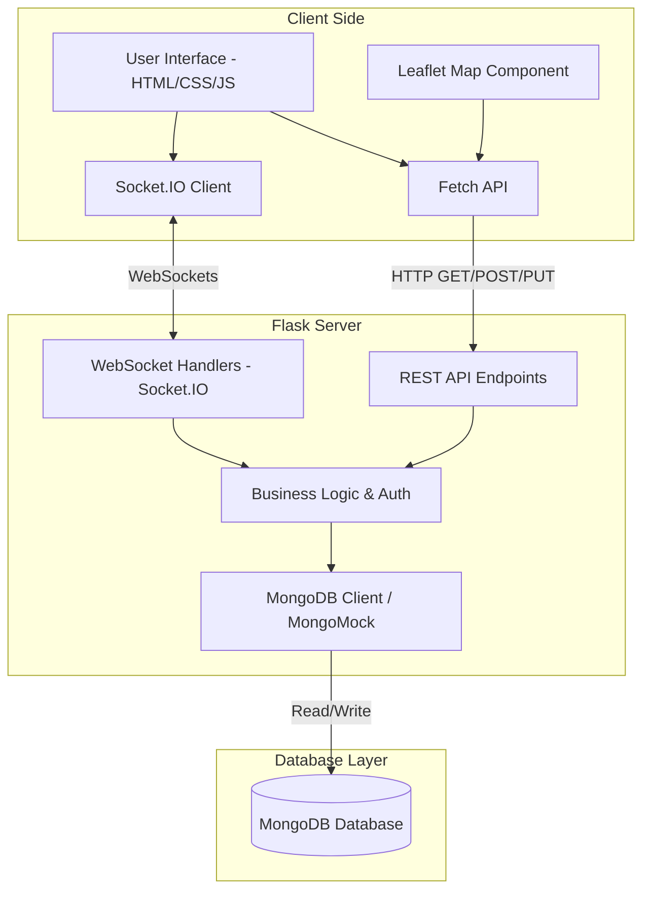

# Europa Peace System Architecture

This document presents the internal architecture of the Europa Peace System.

## Component Diagram

## Description

- **Client Side**: Uses plain HTML/CSS/JS, incorporating the Leaflet library for dynamic maps. It communicates with the backend via Fetch API for standard REST requests, and Socket.IO for real-time bidirectional communication (diplomatic chats, etc.).
- **Flask Server**: Acts as the backend serving the `index.html` file and offering an API. Uses `flask-socketio` to manage active WebSocket sessions. The `mongomock` fallback allows it to work out of the box in memory even if MongoDB is not installed.
- **Database Layer**: MongoDB holds persistent collections such as `countries`, `users`, `independence_requests`, `audiences`, and `reports`.
